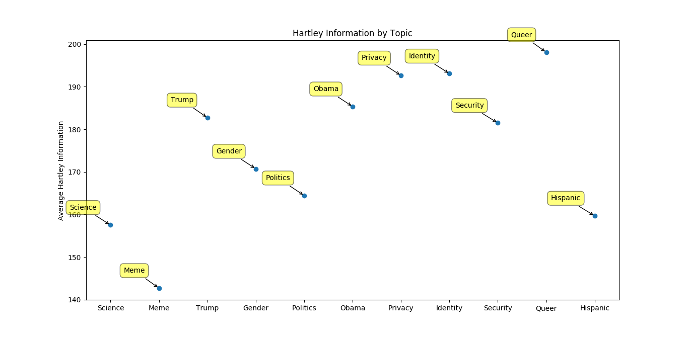

# HartleyNLP
Quantifying the average Hartley information quotient in language from Twitter

# Hartley information
	H = n log s 

	Where n is the number of symbols used, s is the number of independent symbols that can be used

# Applied to Tweets 
	Tweepy 

# Visualized
</img>
